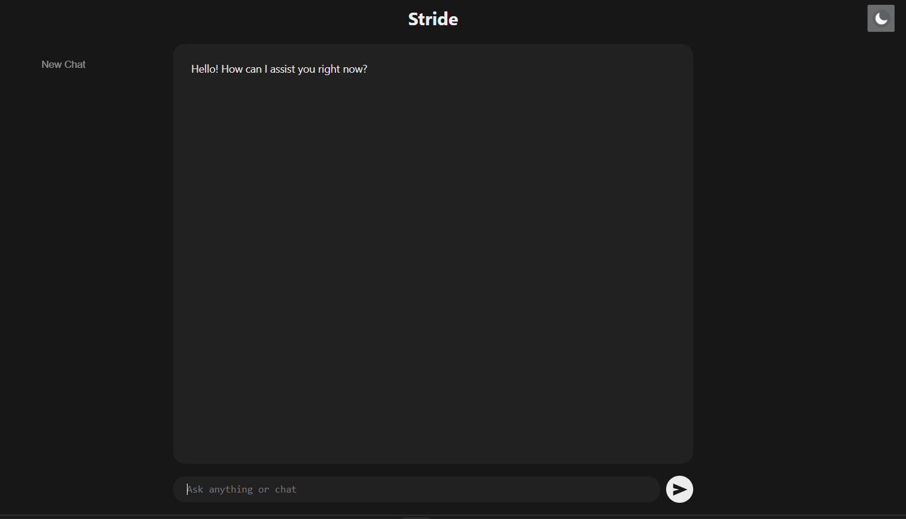

# 🏃‍♂️ Stride AI | The AI Partner That Keeps You on Track

---

## 📖 Overview
Stride AI is your AI-powered accountability and study companion, designed to help you stay focused and productive. It tracks your goals and progress while retaining history across sessions for a seamless, context-aware experience. 

Acting as a reliable, ever-present partner, Stride supports your academic and personal growth and helps you achieve your objectives.

---

## ✨ Key Features

### 🎨 Dynamic User Interface
* **Intuitive Workspace:** Clean and responsive interface for smooth interaction.
* **Responsive Sidebar:** Easy navigation across devices.
* **Dark and Light Modes:** Toggleable themes for comfortable viewing.
* **Real-time Interaction:** Interaction streaming with automatic scroll to latest message.
* **Code Highlighting UI:** Displays code snippets with syntax highlighting for easier reading.

### 📊 Stride Progress Tracker
* Provides user progress over time in a table format.
* Clear summary of tasks completed and ongoing goals.
* Designed for productivity tracking and accountability.

### 🤝 Personalized Accountability Partner
* Stride interprets and tracks your goals, visions, and tasks.
* Providing proactive reminders and prompts to keep you on track.

### 🧠 Intelligent Study Assistance
* Beyond accountability, Stride can assist with studies by providing insights, explanations, and structured support tailored to your learning needs.

### 💾 Persistent Memory and Context
* **Client-side Persistent Storage:** Stride retains your session history and shared details using browser localStorage. 
* Each session picks up seamlessly, creating a continuous, context-aware conversation.

### 💬 Human-like Conversation
* Stride communicates naturally and fluidly, making interactions feel like a collaborative and supportive exchange rather than a standard AI tool.

---

## 🔮 Future Goals

- [ ] **Backend Integration:** Transition from `localStorage` to a comprehensive full-stack architecture with dedicated database storage.
- [ ] **Smart Notifications:** Implement a system for real-time reminders and goal alerts to maintain user accountability.
- [ ] **One-Click Copy:** Add a feature allowing users to easily copy interaction transcripts or generated code snippets.
- [ ] **Advanced Table UI:** Enhance the design and interactivity of the progress tracker to provide deeper data visualization.

---

## 🛠 Tech Stack
* **Frontend:** React, Vite
* **AI Integration:** Gemini API
* **Client-side Persistent Storage:** Uses browser localStorage to retain history and context.

---

## 🎯 Problem Solved
Stride AI addresses challenges in self-discipline, productivity, and consistent support for personal and academic growth. By providing an intelligent, always-present accountability partner, it helps users overcome procrastination, maintain focus, and track progress effectively.

---

How to Get Started:

Clone the repository: git clone https://github.com/Diksha0032/Stride

Navigate to the project directory: cd Stride

Install dependencies: npm install

Set up your Gemini API key by creating a .env file in the root: VITE_GEMINI_API_KEY=your_gemini_api_key_here

Start the development server: npm run dev

## 📸 Screenshots

| Chat Interface | Dark Mode |
|----------------|-----------|
|  |  |

| Code UI Demo | Sidebar Demo |
|--------------|--------------|
|  |  |
